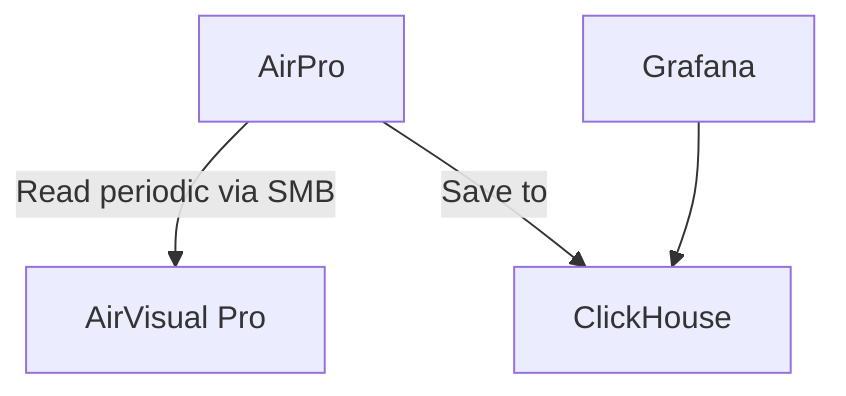

AirPro
======

Simple analytic tool for AirVisual Pro

```mermaid
graph TD
    App[AirPro] --> |Read periodic via SMB| Sensor[AirVisual Pro]
    App[AirPro] --> |Save to| DB[ClickHouse]
    Grafana --> DB[ClickHouse]
```

About
-----

AirPro is open source project, released by MIT license.

Look, feel, be happy :-)
